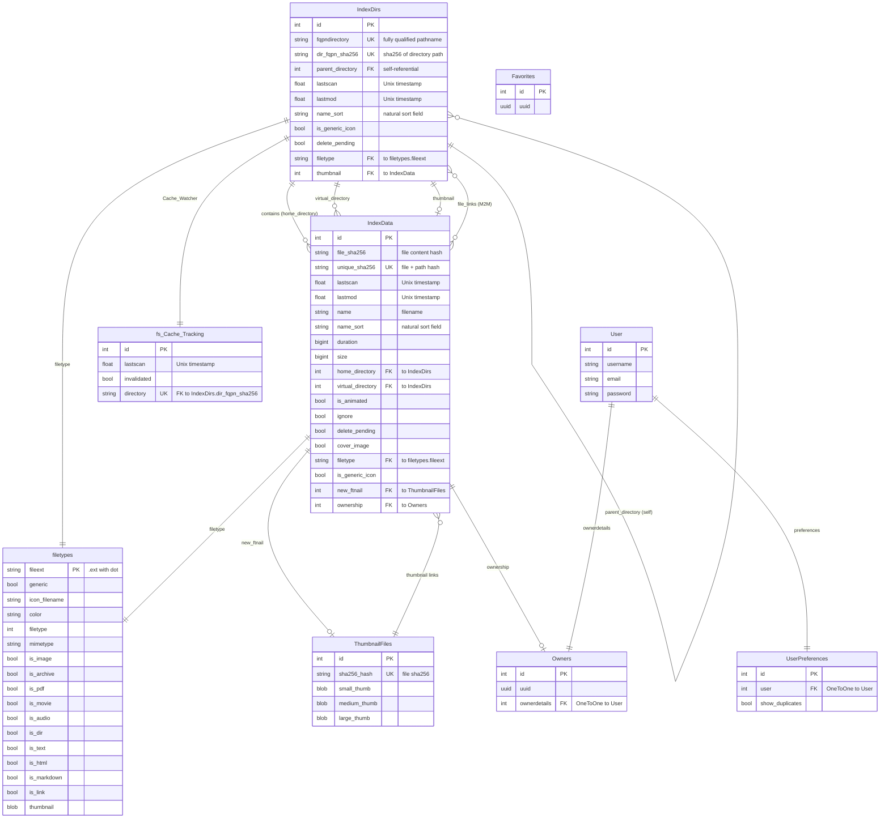

# QuickBBS Database Entity Relationship Diagram

This ERD shows all database models and their relationships in the QuickBBS gallery application.



## Model Descriptions

### Core Gallery Models

#### IndexDirs
Master directory index for the gallery filesystem. Each record represents a folder in the albums directory.
- **Primary Key**: Auto-incrementing `id`
- **Unique Keys**: `fqpndirectory` (path), `dir_fqpn_sha256` (hash)
- **Self-referential**: `parent_directory` links to parent folder
- **Relationships**:
  - Has many files (`IndexData.home_directory`)
  - Has optional thumbnail (`thumbnail` → `IndexData`)
  - Can link to files via M2M (`file_links`)
  - Tracked by cache system (`Cache_Watcher`)

#### IndexData
Master file index for all files in the gallery.
- **Primary Key**: Auto-incrementing `id`
- **Unique Key**: `unique_sha256` (hash of file content + path)
- **Key Fields**:
  - `file_sha256`: Hash of file content (allows duplicate detection)
  - `unique_sha256`: Hash of file + path (unique identifier)
  - `home_directory`: Physical directory location
  - `virtual_directory`: Optional virtual organization
- **Relationships**:
  - Belongs to directory (`home_directory` → `IndexDirs`)
  - Has filetype metadata (`filetype` → `filetypes`)
  - Has thumbnail (`new_ftnail` → `ThumbnailFiles`)
  - Can be directory thumbnail (reverse: `IndexDirs.thumbnail`)

### Supporting Models

#### filetypes
Defines file type characteristics and generic icons.
- **Primary Key**: `fileext` (e.g., ".jpg", ".pdf")
- **Purpose**: Store filetype metadata, MIME types, and generic icons
- **Boolean flags**: Quick tests for images, movies, PDFs, archives, etc.

#### ThumbnailFiles
Binary storage for generated thumbnails (3 sizes per file).
- **Primary Key**: Auto-incrementing `id`
- **Unique Key**: `sha256_hash` (file content hash)
- **Storage**: `small_thumb`, `medium_thumb`, `large_thumb` (binary fields)
- **Design**: One thumbnail record per unique file (deduplication by hash)

#### fs_Cache_Tracking
Tracks which directories have been scanned and cached.
- **Primary Key**: Auto-incrementing `id`
- **OneToOne**: `directory` → `IndexDirs.dir_fqpn_sha256`
- **Purpose**: Invalidate cached gallery data when filesystem changes
- **Watchdog Integration**: Monitors filesystem and sets `invalidated` flag

#### Owners
Stub model for future permissions system.
- **Primary Key**: Auto-incrementing `id`
- **OneToOne**: `ownerdetails` → Django `User`
- **Purpose**: Link files to user ownership

#### UserPreferences
Store user-specific gallery preferences.
- **Primary Key**: Auto-incrementing `id`
- **OneToOne**: `user` → Django `User`
- **Settings**: `show_duplicates` (display duplicate files)

#### Favorites
Placeholder for future favorites functionality.
- **Status**: Stub model with no relationships yet

## Key Relationships Explained

### Directory Hierarchy
```
IndexDirs (parent)
    ↓ parent_directory (self-referential FK)
IndexDirs (child)
    ↓ IndexData_entries (reverse FK)
IndexData (files in directory)
```

### Thumbnail System
```
IndexData (file)
    ↓ file_sha256
ThumbnailFiles (sha256_hash match)
    → small_thumb, medium_thumb, large_thumb
```

### Cache Invalidation
```
IndexDirs (directory)
    ↔ Cache_Watcher (OneToOne)
fs_Cache_Tracking (invalidated flag)
```

### File Type Detection
```
IndexData (file)
    ↓ filetype (FK)
filetypes (fileext = ".jpg")
    → is_image=True, mimetype="image/jpeg", etc.
```

## Database Indexes

The models use extensive indexing for performance:

### IndexDirs Indexes
- `dir_fqpn_sha256` (unique, primary lookup)
- `parent_directory + delete_pending` (composite)
- `filetype` (foreign key)

### IndexData Indexes
- `file_sha256` (duplicate detection)
- `unique_sha256` (unique, primary lookup)
- `home_directory + delete_pending` (composite)
- `home_directory + filetype + delete_pending` (composite)
- `file_sha256` partial (unlinked thumbnails)

### ThumbnailFiles Indexes
- `sha256_hash` (unique, primary lookup)
- Partial indexes for thumbnail existence checks

### fs_Cache_Tracking Indexes
- `directory + invalidated` (composite)

## Design Patterns

### SHA256 Hashing
- **file_sha256**: Content hash (allows duplicate detection across locations)
- **unique_sha256**: Content + path hash (stable unique ID across DB rebuilds)
- **dir_fqpn_sha256**: Directory path hash (stable directory lookup)

### Deduplication
- Files with same `file_sha256` share one `ThumbnailFiles` record
- Saves storage and processing time for duplicate files

### Soft Deletes
- `delete_pending` flag instead of hard deletes
- Allows recovery and cleanup processes

### Natural Sorting
- `name_sort` fields use `NaturalSortField` for human-friendly ordering
- Sorts "file10.jpg" after "file2.jpg"

### Optimized Prefetching
- Models define `SELECT_RELATED_LIST` and `PREFETCH_LIST` constants
- Reduces N+1 query problems
- Forward FKs use `select_related()` (SQL JOINs)
- Reverse FKs use `prefetch_related()` (separate queries)

## Migration Notes

- Database uses PostgreSQL-specific features (partial indexes, DISTINCT ON)
- SHA256 fields support deduplication and stable identifiers
- Cache tracking system integrates with Watchdog filesystem monitoring
- Models designed for ASGI/async compatibility (see CLAUDE.md)
