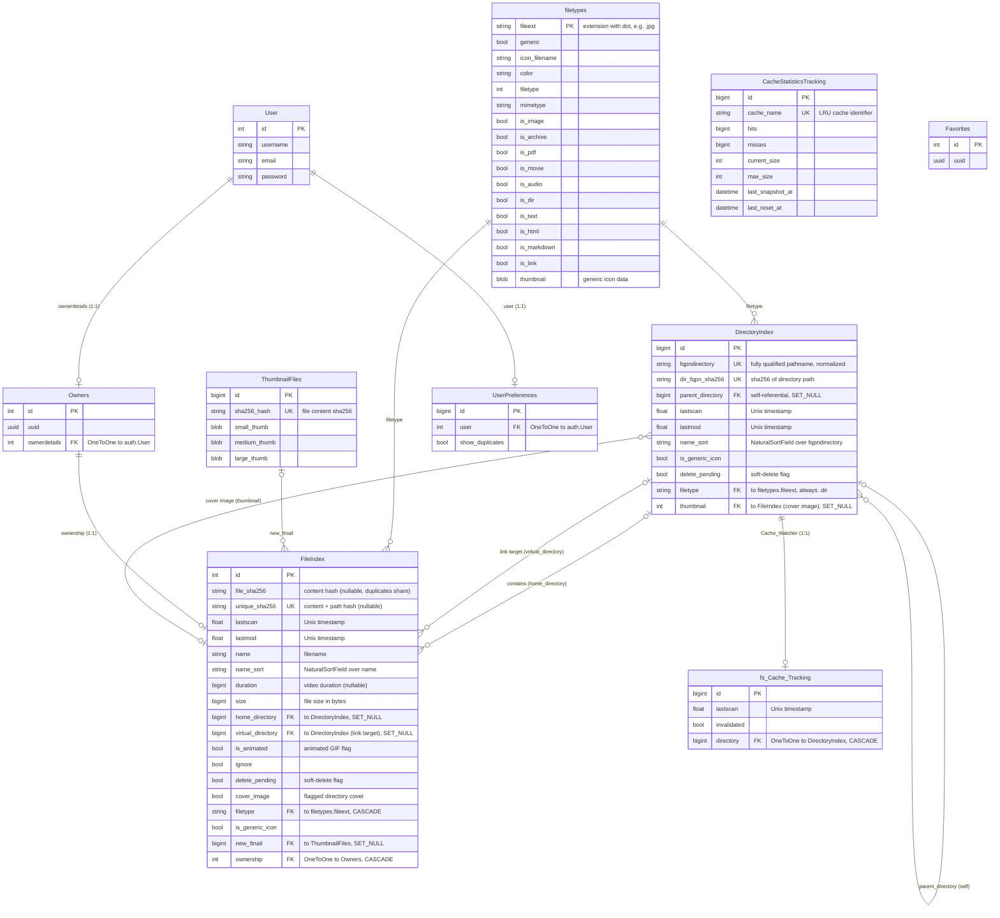

# QuickBBS Database Entity Relationship Diagram

This ERD shows the QuickBBS application models and their relationships, generated from the current codebase (2026-07-06, post-migration `quickbbs.0040` which removed the unused `file_links` M2M).


```mermaid
erDiagram
    %% Core Gallery Relationships
    DirectoryIndex |o--o{ FileIndex : "contains (home_directory)"
    DirectoryIndex |o--o{ FileIndex : "link target (virtual_directory)"
    FileIndex |o--o{ DirectoryIndex : "cover image (thumbnail)"
    DirectoryIndex |o--o{ DirectoryIndex : "parent_directory (self)"
    filetypes ||--o{ DirectoryIndex : "filetype"
    filetypes ||--o{ FileIndex : "filetype"

    %% Thumbnail Storage
    ThumbnailFiles |o--o{ FileIndex : "new_ftnail"

    %% Cache Tracking
    DirectoryIndex ||--o| fs_Cache_Tracking : "Cache_Watcher (1:1)"

    %% User & Ownership
    User ||--o| Owners : "ownerdetails (1:1)"
    Owners ||--o| FileIndex : "ownership (1:1)"
    User ||--o| UserPreferences : "user (1:1)"

    %% Core Directory Model
    DirectoryIndex {
        bigint id PK
        string fqpndirectory UK "fully qualified pathname, normalized"
        string dir_fqpn_sha256 UK "sha256 of directory path"
        bigint parent_directory FK "self-referential, SET_NULL"
        float lastscan "Unix timestamp"
        float lastmod "Unix timestamp"
        string name_sort "NaturalSortField over fqpndirectory"
        bool is_generic_icon
        bool delete_pending "soft-delete flag"
        string filetype FK "to filetypes.fileext, always .dir"
        int thumbnail FK "to FileIndex (cover image), SET_NULL"
    }

    %% Core File Model
    FileIndex {
        int id PK
        string file_sha256 "content hash (nullable, duplicates share)"
        string unique_sha256 UK "content + path hash (nullable)"
        float lastscan "Unix timestamp"
        float lastmod "Unix timestamp"
        string name "filename"
        string name_sort "NaturalSortField over name"
        bigint duration "video duration (nullable)"
        bigint size "file size in bytes"
        bigint home_directory FK "to DirectoryIndex, SET_NULL"
        bigint virtual_directory FK "to DirectoryIndex (link target), SET_NULL"
        bool is_animated "animated GIF flag"
        bool ignore
        bool delete_pending "soft-delete flag"
        bool cover_image "flagged directory cover"
        string filetype FK "to filetypes.fileext, CASCADE"
        bool is_generic_icon
        bigint new_ftnail FK "to ThumbnailFiles, SET_NULL"
        int ownership FK "OneToOne to Owners, CASCADE"
    }

    %% File Type Definitions
    filetypes {
        string fileext PK "extension with dot, e.g. .jpg"
        bool generic
        string icon_filename
        string color
        int filetype
        string mimetype
        bool is_image
        bool is_archive
        bool is_pdf
        bool is_movie
        bool is_audio
        bool is_dir
        bool is_text
        bool is_html
        bool is_markdown
        bool is_link
        blob thumbnail "generic icon data"
    }

    %% Thumbnail Storage
    ThumbnailFiles {
        bigint id PK
        string sha256_hash UK "file content sha256"
        blob small_thumb
        blob medium_thumb
        blob large_thumb
    }

    %% Cache Tracking
    fs_Cache_Tracking {
        bigint id PK
        float lastscan "Unix timestamp"
        bool invalidated
        bigint directory FK "OneToOne to DirectoryIndex, CASCADE"
    }

    %% Cache Statistics (standalone, no relationships)
    CacheStatisticsTracking {
        bigint id PK
        string cache_name UK "LRU cache identifier"
        bigint hits
        bigint misses
        int current_size
        int max_size
        datetime last_snapshot_at
        datetime last_reset_at
    }

    %% Ownership
    Owners {
        int id PK
        uuid uuid
        int ownerdetails FK "OneToOne to auth.User"
    }

    %% User Preferences
    UserPreferences {
        bigint id PK
        int user FK "OneToOne to auth.User"
        bool show_duplicates
    }

    %% Favorites (stub model, no relationships yet)
    Favorites {
        int id PK
        uuid uuid
    }

    %% Django User Model (django.contrib.auth)
    User {
        int id PK
        string username
        string email
        string password
    }
```

## Model Descriptions

### Core Gallery Models (`quickbbs` app)

#### DirectoryIndex (`quickbbs_directoryindex`)
Master directory index for the gallery filesystem. Each record represents a folder under the albums root.
- **Primary Key**: Auto-incrementing `id` (BigAutoField)
- **Unique Keys**: `fqpndirectory` (normalized path), `dir_fqpn_sha256` (path hash — primary lookup)
- **Self-referential**: `parent_directory` links to the parent folder (NULL at the albums root)
- **Relationships**:
  - Has many files — reverse accessor `FileIndex_entries` (from `FileIndex.home_directory`)
  - Is the link target for `.link`/`.alias` files — reverse accessor `Virtual_FileIndex` (from `FileIndex.virtual_directory`)
  - Has an optional cover image (`thumbnail` → `FileIndex`)
  - Tracked by the cache system — reverse accessor `Cache_Watcher` (1:1 from `fs_Cache_Tracking.directory`)

#### FileIndex (`quickbbs_fileindex`)
Master file index for all files in the gallery. One row per physical file path.
- **Primary Key**: Auto-incrementing `id`
- **Unique Key**: `unique_sha256` (hash of file content + path — stable across DB rebuilds)
- **Key Fields**:
  - `file_sha256`: content-only hash; identical files in different locations share the same value (duplicate detection, shared thumbnails)
  - `home_directory`: the physical containing directory (many-to-one FK)
  - `virtual_directory`: for `.link`/`.alias` files only — the directory the link resolves to
- **Relationships**:
  - Belongs to one directory (`home_directory` → `DirectoryIndex`)
  - Has filetype metadata (`filetype` → `filetypes`)
  - Shares a thumbnail record with content-identical files (`new_ftnail` → `ThumbnailFiles`)
  - Can serve as a directory's cover image — reverse accessor `dir_thumbnail` (from `DirectoryIndex.thumbnail`)
  - Optional ownership (`ownership` 1:1 → `Owners`)

> **Note (2026-07-06):** The former `DirectoryIndex.file_links` ManyToMany to `FileIndex` was removed in migration `quickbbs.0040`. It was never populated; the directory↔file relationship is fully expressed by the `home_directory` / `virtual_directory` / `thumbnail` foreign keys. See `claude_docs/fable_m2m.md` for the analysis.

### Supporting Models

#### filetypes (`filetypes_filetypes`, `filetypes` app)
Defines file type characteristics and generic icons.
- **Primary Key**: `fileext` (e.g., ".jpg", ".pdf", ".dir")
- **Purpose**: MIME types, category flags, and generic icon data
- **Boolean flags**: quick tests for images, movies, PDFs, archives, text, links, etc.

#### ThumbnailFiles (`thumbnails_thumbnailfiles`, `thumbnails` app)
Binary storage for generated thumbnails (three sizes per unique file content).
- **Primary Key**: Auto-incrementing `id` (BigAutoField)
- **Unique Key**: `sha256_hash` (file content hash)
- **Storage**: `small_thumb`, `medium_thumb`, `large_thumb` (nullable BinaryFields)
- **Design**: one record per unique `file_sha256` — all duplicate files link to the same record via `FileIndex.new_ftnail`
- **Integrity**: a CheckConstraint forbids empty-bytes (`b""`) thumbnails — sizes are either NULL (not generated) or real data

#### fs_Cache_Tracking (`CacheWatcher_fs_cache_tracking`, `cache_watcher` app)
Tracks which directories have been scanned and whether their cached state is still valid.
- **Primary Key**: Auto-incrementing `id` (BigAutoField)
- **OneToOne**: `directory` → `DirectoryIndex` (CASCADE — cache rows die with their directory)
- **Purpose**: the Watchdog filesystem monitor sets `invalidated=True` when a directory changes; gallery views re-sync invalidated directories on demand

#### CacheStatisticsTracking (`cache_statistics_tracking`, `cache_watcher` app)
Standalone persistence for in-process LRU cache statistics (no FK relationships).
- **Unique Key**: `cache_name` — one row per monitored cache (e.g. `directoryindex`, `fileindex`, layout caches)
- **Purpose**: hit/miss/size snapshots from `MonitoredCache` survive process restarts

#### Owners (`quickbbs_owners`)
Ownership link between files and Django users (groundwork for a permissions system).
- **OneToOne**: `ownerdetails` → Django `User`; reverse 1:1 from `FileIndex.ownership`

#### UserPreferences (`user_preferences_userpreferences`, `user_preferences` app)
Per-user gallery preferences.
- **OneToOne**: `user` → Django `User`
- **Settings**: `show_duplicates` (whether item navigation includes duplicate files)

#### Favorites (`quickbbs_favorites`)
Placeholder for future favorites functionality — stub with `id` and `uuid` only, no relationships yet.

### Third-Party / Framework Tables (not diagrammed)

| App | Models | Purpose |
|---|---|---|
| `django.contrib.auth` | `User`, `Group`, `Permission` | Authentication (User is diagrammed where project models link to it) |
| `django.contrib.admin` / `contenttypes` / `sessions` / `sites` | `LogEntry`, `ContentType`, `Session`, `Site` | Framework plumbing |
| `allauth` (`account`, `socialaccount`) | `EmailAddress`, `EmailConfirmation`, `SocialApp`, `SocialAccount`, `SocialToken` | Login/registration flows |
| `allauth.mfa` | `Authenticator` | Passkeys / MFA (WebAuthn) |
| `django-dbtasks` (`dbtasks`) | `ScheduledTask` | Background task queue (`manage.py taskrunner`) |

## Key Relationships Explained

### Directory Hierarchy
```
DirectoryIndex (parent)
    ↓ parent_directory (self-referential FK, SET_NULL)
DirectoryIndex (child)
    ↓ FileIndex_entries (reverse of home_directory FK)
FileIndex (files in directory)
```

### Thumbnail Sharing (deduplication)
```
FileIndex rows with identical file_sha256  (any number of paths)
    ↓ new_ftnail FK (all point to the same row)
ThumbnailFiles (sha256_hash == file_sha256)
    → small_thumb / medium_thumb / large_thumb
```

### Link Files (.link / .alias)
```
FileIndex (filetype.is_link = True)
    ↓ virtual_directory FK
DirectoryIndex (the directory the shortcut resolves to)
```

### Cache Invalidation
```
Watchdog observes filesystem change
    → fs_Cache_Tracking.invalidated = True   (1:1 with DirectoryIndex)
    → next gallery request re-syncs the directory and re-validates
```

## Database Indexes (current, post index-prune of 2026-07-04)

### DirectoryIndex
- `fqpndirectory` unique constraint; `dir_fqpn_sha256` unique constraint (primary lookup)
- `(parent_directory, delete_pending)` composite
- `(dir_fqpn_sha256, delete_pending)` composite
- `fqpndirectory` trigram GIN (`directoryindex_fqpn_trgm_idx`) — serves search `icontains`/`iregex`

### FileIndex
- `unique_sha256` unique constraint (primary lookup)
- `(file_sha256, delete_pending)` composite
- `name` btree (`quickbbs_fileindex_name_idx`)
- `(filetype, delete_pending)` composite (`fileindex_filetype_delete_idx`)
- `(home_directory, filetype, delete_pending)` composite (`fileindex_home_type_delete_idx`)
- `file_sha256` partial, `WHERE new_ftnail IS NULL` (`fileindex_sha256_unlinked_idx`) — thumbnail linking
- `id` partial, `WHERE delete_pending` (`fileindex_delete_pending_idx`) — cleanup pass
- `name` trigram GIN (`fileindex_name_trgm_idx`) — serves search `icontains`/`iregex`

### ThumbnailFiles
- `sha256_hash` unique (primary lookup)
- Partial indexes on `sha256_hash` for "has small thumb" / "missing small thumb" checks
- CheckConstraint: no `b""` thumbnail values (NULL or real data only)

### fs_Cache_Tracking
- `(directory, invalidated)` composite; `directory` unique (OneToOne)

## Design Patterns

### SHA256 Hashing
- **file_sha256**: content hash — duplicate detection across locations, thumbnail sharing
- **unique_sha256**: content + path hash — stable unique ID that survives DB rebuilds
- **dir_fqpn_sha256**: directory path hash — stable directory lookup key

### Deduplication
- Files with the same `file_sha256` share one `ThumbnailFiles` record
- Gallery views can deduplicate listings via PostgreSQL `DISTINCT ON (file_sha256)`

### Soft Deletes
- `delete_pending` flag instead of immediate hard deletes; cleanup passes remove flagged rows

### Natural Sorting
- `name_sort` fields use `NaturalSortField` for human-friendly ordering ("file2" before "file10")

### Optimized Fetching
- Per-model `select_related` tuples are defined as module constants (`FILEINDEX_SR_*` in `fileindex.py`, `DIRECTORYINDEX_SR_*` in `directoryindex.py`, `THUMBNAILFILES_PR_*` in `thumbnails/models.py`) and passed explicitly by callers
- Forward FKs use `select_related()` (SQL JOINs); reverse FKs/1:1 use `prefetch_related()` where needed
- Hot lookups are fronted by in-process LRU caches (`MonitoredCache`), with statistics persisted to `CacheStatisticsTracking`

## Migration Notes

- PostgreSQL-specific features in use: partial indexes, trigram GIN indexes (`pg_trgm`), `DISTINCT ON`
- Migration `quickbbs.0040` (2026-07-06) dropped the empty `quickbbs_directoryindex_file_links` join table
- Cache tracking integrates with the Watchdog filesystem monitor
- Models are designed for ASGI/async compatibility (see CLAUDE.md / `.claude/critical-runtime.md`)
