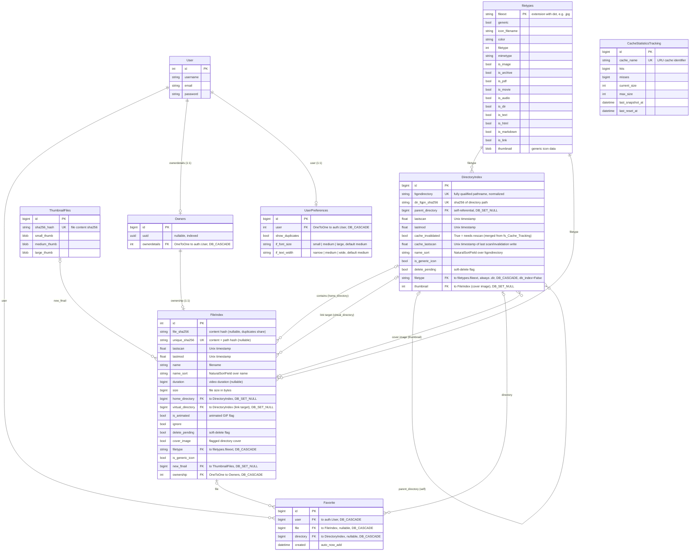

# QuickBBS Database Entity Relationship Diagram

**Date Created:** 2025-11-14  
**Last Updated:** 2026-09-20  
**Last Reviewed:** 2026-09-20

This ERD shows the QuickBBS application models and their relationships, read
from the Django model definitions at head migrations `quickbbs.0043`,
`cache_watcher.0014` and `user_preferences.0004`.

**Every foreign key in this schema uses the DB-enforced `on_delete` variants**
— `models.DB_CASCADE` and `models.DB_SET_NULL` — which emit real
`ON DELETE` constraints and require Django 6.1 or newer. They are not the
app-level `models.CASCADE`/`models.SET_NULL`.


```mermaid
erDiagram
    %% Core Gallery Relationships
    DirectoryIndex |o--o{ FileIndex : "contains (home_directory)"
    DirectoryIndex |o--o{ FileIndex : "link target (virtual_directory)"
    FileIndex |o--o{ DirectoryIndex : "cover image (thumbnail)"
    DirectoryIndex |o--o{ DirectoryIndex : "parent_directory (self)"
    filetypes ||--o{ DirectoryIndex : "filetype"
    filetypes ||--o{ FileIndex : "filetype"

    %% Thumbnail Storage
    ThumbnailFiles |o--o{ FileIndex : "new_ftnail"

    %% Favorites
    User ||--o{ Favorite : "user"
    FileIndex |o--o{ Favorite : "file"
    DirectoryIndex |o--o{ Favorite : "directory"

    %% User & Ownership
    User ||--o| Owners : "ownerdetails (1:1)"
    Owners ||--o| FileIndex : "ownership (1:1)"
    User ||--o| UserPreferences : "user (1:1)"

    %% Core Directory Model
    DirectoryIndex {
        bigint id PK
        string fqpndirectory UK "fully qualified pathname, normalized"
        string dir_fqpn_sha256 UK "sha256 of directory path"
        bigint parent_directory FK "self-referential, DB_SET_NULL"
        float lastscan "Unix timestamp"
        float lastmod "Unix timestamp"
        bool cache_invalidated "True = needs rescan (merged from fs_Cache_Tracking)"
        float cache_lastscan "Unix timestamp of last scan/invalidation write"
        string name_sort "NaturalSortField over fqpndirectory"
        bool is_generic_icon
        bool delete_pending "soft-delete flag"
        string filetype FK "to filetypes.fileext, always .dir, DB_CASCADE, db_index=False"
        int thumbnail FK "to FileIndex (cover image), DB_SET_NULL"
    }

    %% Core File Model
    FileIndex {
        int id PK
        string file_sha256 "content hash (nullable, duplicates share)"
        string unique_sha256 UK "content + path hash (nullable)"
        float lastscan "Unix timestamp"
        float lastmod "Unix timestamp"
        string name "filename"
        string name_sort "NaturalSortField over name"
        bigint duration "video duration (nullable)"
        bigint size "file size in bytes"
        bigint home_directory FK "to DirectoryIndex, DB_SET_NULL"
        bigint virtual_directory FK "to DirectoryIndex (link target), DB_SET_NULL"
        bool is_animated "animated GIF flag"
        bool ignore
        bool delete_pending "soft-delete flag"
        bool cover_image "flagged directory cover"
        string filetype FK "to filetypes.fileext, DB_CASCADE"
        bool is_generic_icon
        bigint new_ftnail FK "to ThumbnailFiles, DB_SET_NULL"
        int ownership FK "OneToOne to Owners, DB_CASCADE"
    }

    %% File Type Definitions
    filetypes {
        string fileext PK "extension with dot, e.g. .jpg"
        bool generic
        string icon_filename
        string color
        int filetype
        string mimetype
        bool is_image
        bool is_archive
        bool is_pdf
        bool is_movie
        bool is_audio
        bool is_dir
        bool is_text
        bool is_html
        bool is_markdown
        bool is_link
        blob thumbnail "generic icon data"
    }

    %% Thumbnail Storage
    ThumbnailFiles {
        bigint id PK
        string sha256_hash UK "file content sha256"
        blob small_thumb
        blob medium_thumb
        blob large_thumb
    }

    %% Cache Statistics (standalone, no relationships)
    CacheStatisticsTracking {
        bigint id PK
        string cache_name UK "LRU cache identifier"
        bigint hits
        bigint misses
        int current_size
        int max_size
        datetime last_snapshot_at
        datetime last_reset_at
    }

    %% Ownership
    Owners {
        bigint id PK
        uuid uuid "nullable, indexed"
        int ownerdetails FK "OneToOne to auth.User, DB_CASCADE"
    }

    %% User Preferences
    UserPreferences {
        bigint id PK
        int user FK "OneToOne to auth.User, DB_CASCADE"
        bool show_duplicates
        string if_font_size "small | medium | large, default medium"
        string if_text_width "narrow | medium | wide, default medium"
    }

    %% Favorites
    Favorite {
        bigint id PK
        bigint user FK "to auth.User, DB_CASCADE"
        bigint file FK "to FileIndex, nullable, DB_CASCADE"
        bigint directory FK "to DirectoryIndex, nullable, DB_CASCADE"
        datetime created "auto_now_add"
    }

    %% Django User Model (django.contrib.auth)
    User {
        int id PK
        string username
        string email
        string password
    }
```

## Model Descriptions

### Core Gallery Models (`quickbbs` app)

#### DirectoryIndex (`quickbbs_directoryindex`)
Master directory index for the gallery filesystem. Each record represents a folder under the albums root.
- **Primary Key**: Auto-incrementing `id` (BigAutoField)
- **Unique Keys**: `fqpndirectory` (normalized path), `dir_fqpn_sha256` (path hash — primary lookup)
- **Self-referential**: `parent_directory` links to the parent folder (NULL at the albums root)
- **Relationships**:
  - Has many files — reverse accessor `FileIndex_entries` (from `FileIndex.home_directory`)
  - Is the link target for `.link`/`.alias` files — reverse accessor `Virtual_FileIndex` (from `FileIndex.virtual_directory`)
  - Has an optional cover image (`thumbnail` → `FileIndex`)
  - Has many favorites — reverse accessor from `Favorite.directory`
- **Cache tracking**: `cache_invalidated` and `cache_lastscan` live on this model.
  They were merged here from the former `cache_watcher.fs_Cache_Tracking`, which
  was deleted in migration `cache_watcher.0014`. Neither field is indexed —
  every access path reaches the row via `dir_fqpn_sha256` or the primary key, and
  leaving them unindexed keeps watcher-driven `UPDATE`s HOT-eligible.

#### FileIndex (`quickbbs_fileindex`)
Master file index for all files in the gallery. One row per physical file path.
- **Primary Key**: Auto-incrementing `id`
- **Unique Key**: `unique_sha256` (hash of file content + path — stable across DB rebuilds)
- **Key Fields**:
  - `file_sha256`: content-only hash; identical files in different locations share the same value (duplicate detection, shared thumbnails)
  - `home_directory`: the physical containing directory (many-to-one FK)
  - `virtual_directory`: for `.link`/`.alias` files only — the directory the link resolves to
- **Relationships**:
  - Belongs to one directory (`home_directory` → `DirectoryIndex`)
  - Has filetype metadata (`filetype` → `filetypes`)
  - Shares a thumbnail record with content-identical files (`new_ftnail` → `ThumbnailFiles`)
  - Can serve as a directory's cover image — reverse accessor `dir_thumbnail` (from `DirectoryIndex.thumbnail`)
  - Optional ownership (`ownership` 1:1 → `Owners`)

> **Note (2026-07-06):** The former `DirectoryIndex.file_links` ManyToMany to `FileIndex` was removed in migration `quickbbs.0040`. It was never populated; the directory↔file relationship is fully expressed by the `home_directory` / `virtual_directory` / `thumbnail` foreign keys.

### Supporting Models

#### filetypes (`filetypes_filetypes`, `filetypes` app)
Defines file type characteristics and generic icons.
- **Primary Key**: `fileext` (e.g., ".jpg", ".pdf", ".dir")
- **Purpose**: MIME types, category flags, and generic icon data
- **Boolean flags**: quick tests for images, movies, PDFs, archives, text, links, etc.

#### ThumbnailFiles (`thumbnails_thumbnailfiles`, `thumbnails` app)
Binary storage for generated thumbnails (three sizes per unique file content).
- **Primary Key**: Auto-incrementing `id` (BigAutoField)
- **Unique Key**: `sha256_hash` (file content hash)
- **Storage**: `small_thumb`, `medium_thumb`, `large_thumb` (nullable BinaryFields)
- **Design**: one record per unique `file_sha256` — all duplicate files link to the same record via `FileIndex.new_ftnail`
- **Integrity**: a CheckConstraint forbids empty-bytes (`b""`) thumbnails — sizes are either NULL (not generated) or real data

#### CacheStatisticsTracking (`cache_statistics_tracking`, `cache_watcher` app)
Standalone persistence for in-process LRU cache statistics (no FK relationships).
- **Unique Key**: `cache_name` — one row per monitored cache (e.g. `directoryindex`, `fileindex`, layout caches)
- **Purpose**: hit/miss/size snapshots from `MonitoredCache` survive process restarts

#### Owners (`quickbbs_owners`)
Ownership link between files and Django users (groundwork for a permissions system).
- **OneToOne**: `ownerdetails` → Django `User`; reverse 1:1 from `FileIndex.ownership`

#### UserPreferences (`user_preferences_userpreferences`, `user_preferences` app)
Per-user gallery preferences.
- **OneToOne**: `user` → Django `User`
- **Settings**: `show_duplicates` (whether item navigation includes duplicate
  files), `if_font_size` and `if_text_width` (Interactive Fiction reader display,
  each `small`/`medium`/`large` or `narrow`/`medium`/`wide`, defaulting to `medium`)

#### Favorite (`quickbbs_favorite`)
One row per favorited item, per user. Added in migration `quickbbs.0043`.
- **Primary Key**: Auto-incrementing `id` (BigAutoField)
- **Foreign keys**: `user` → Django `User`, `file` → `FileIndex` (nullable),
  `directory` → `DirectoryIndex` (nullable) — all `DB_CASCADE`
- **Constraints**: `favorite_exactly_one_target` (a CheckConstraint enforcing that
  exactly one of `file`/`directory` is set), plus `unique_user_file_favorite` and
  `unique_user_directory_favorite`
- **Index**: `["user", "-created"]` — the listing order for a user's favorites page

### Third-Party / Framework Tables (not diagrammed)

| App | Models | Purpose |
|---|---|---|
| `django.contrib.auth` | `User`, `Group`, `Permission` | Authentication (User is diagrammed where project models link to it) |
| `django.contrib.admin` / `contenttypes` / `sessions` / `sites` | `LogEntry`, `ContentType`, `Session`, `Site` | Framework plumbing |
| `allauth` (`account`, `socialaccount`) | `EmailAddress`, `EmailConfirmation`, `SocialApp`, `SocialAccount`, `SocialToken` | Login/registration flows |
| `allauth.mfa` | `Authenticator` | Passkeys / MFA (WebAuthn) |
| `django-dbtasks` (`dbtasks`) | `ScheduledTask` | Background task queue (`manage.py taskrunner`) |

The `interactive_fiction` app owns five models of its own — `Story`,
`StoryAccess`, `EngineAPI`, `CurrentGame` and `SaveState`. They are a
self-contained subsystem with no foreign keys into the gallery models above, so
they are not diagrammed here; see
[`interactive_fiction_and_quickbbs.md`](design%20documents/interactive_fiction_and_quickbbs.md).

## Key Relationships Explained

### Directory Hierarchy
```
DirectoryIndex (parent)
    ↓ parent_directory (self-referential FK, DB_SET_NULL)
DirectoryIndex (child)
    ↓ FileIndex_entries (reverse of home_directory FK)
FileIndex (files in directory)
```

### Thumbnail Sharing (deduplication)
```
FileIndex rows with identical file_sha256  (any number of paths)
    ↓ new_ftnail FK (all point to the same row)
ThumbnailFiles (sha256_hash == file_sha256)
    → small_thumb / medium_thumb / large_thumb
```

### Link Files (.link / .alias)
```
FileIndex (filetype.is_link = True)
    ↓ virtual_directory FK
DirectoryIndex (the directory the shortcut resolves to)
```

### Cache Invalidation
```
Watchdog observes filesystem change
    → DirectoryIndex.cache_invalidated = True
    → next gallery request re-syncs the directory and re-validates
```

## Database Indexes (current, post index-prune of 2026-07-04)

### DirectoryIndex
- `fqpndirectory` unique constraint; `dir_fqpn_sha256` unique constraint (primary lookup)
- `(parent_directory, delete_pending)` composite
- `(dir_fqpn_sha256, delete_pending)` composite
- `fqpndirectory` trigram GIN (`directoryindex_fqpn_trgm_idx`) — serves search `icontains`/`iregex`

### FileIndex
- `unique_sha256` unique constraint (primary lookup)
- `(file_sha256, delete_pending)` composite
- `name` btree (`quickbbs_fileindex_name_idx`)
- `(filetype, delete_pending)` composite (`fileindex_filetype_delete_idx`)
- `(home_directory, filetype, delete_pending)` composite (`fileindex_home_type_delete_idx`)
- `file_sha256` partial, `WHERE new_ftnail IS NULL` (`fileindex_sha256_unlinked_idx`) — thumbnail linking
- `id` partial, `WHERE delete_pending` (`fileindex_delete_pending_idx`) — cleanup pass
- `name` trigram GIN (`fileindex_name_trgm_idx`) — serves search `icontains`/`iregex`

### ThumbnailFiles
- `sha256_hash` unique (primary lookup)
- Partial indexes on `sha256_hash` for "has small thumb" / "missing small thumb" checks
- CheckConstraint: no `b""` thumbnail values (NULL or real data only)

### Favorite
- `(user, -created)` composite (`quickbbs_fa_user_id_456b99_idx`) — favorites listing order
- CheckConstraint `favorite_exactly_one_target`; unique constraints on
  `(user, file)` and `(user, directory)`

### DirectoryIndex cache fields
`cache_invalidated` and `cache_lastscan` carry no index, deliberately — see the
DirectoryIndex description above.

## Design Patterns

### SHA256 Hashing
- **file_sha256**: content hash — duplicate detection across locations, thumbnail sharing
- **unique_sha256**: content + path hash — stable unique ID that survives DB rebuilds
- **dir_fqpn_sha256**: directory path hash — stable directory lookup key

### Deduplication
- Files with the same `file_sha256` share one `ThumbnailFiles` record
- Gallery views can deduplicate listings via PostgreSQL `DISTINCT ON (file_sha256)`

### Soft Deletes
- `delete_pending` flag instead of immediate hard deletes; cleanup passes remove flagged rows

### Natural Sorting
- `name_sort` fields use `NaturalSortField` for human-friendly ordering ("file2" before "file10")

### Optimized Fetching
- Per-model `select_related` tuples are defined as module constants (`FILEINDEX_SR_*` in `fileindex.py`, `DIRECTORYINDEX_SR_*` in `directoryindex.py`, `THUMBNAILFILES_PR_*` in `thumbnails/models.py`) and passed explicitly by callers
- Forward FKs use `select_related()` (SQL JOINs); reverse FKs/1:1 use `prefetch_related()` where needed
- Hot lookups are fronted by in-process LRU caches (`MonitoredCache`), with statistics persisted to `CacheStatisticsTracking`

## Migration Notes

- PostgreSQL-specific features in use: partial indexes, trigram GIN indexes (`pg_trgm`), `DISTINCT ON`
- Migration `quickbbs.0040` (2026-07-06) dropped the empty `quickbbs_directoryindex_file_links` join table
- Migrations `cache_watcher.0013`/`0014` copied `fs_Cache_Tracking`'s two columns
  onto `DirectoryIndex` and then deleted that model
- Migration `quickbbs.0043` added the `Favorite` model
- Migration `user_preferences.0004` added `if_font_size` and `if_text_width`
- Cache tracking integrates with the Watchdog filesystem monitor
- Models are designed for ASGI/async compatibility (see CLAUDE.md / `.claude/critical-runtime.md`)
