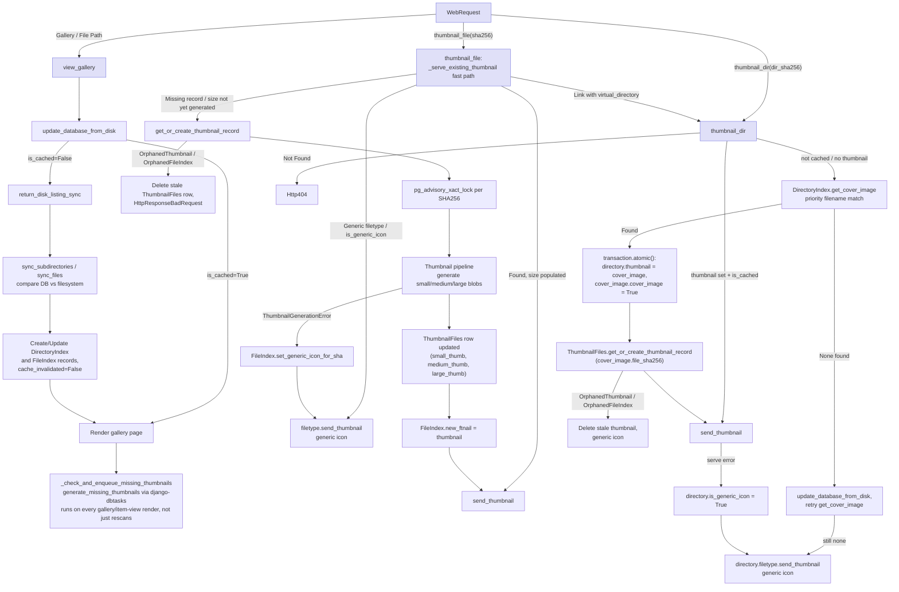

QuickBBS Gallery
================

A high-performance Django-based gallery and file browser application with hybrid file system + database design.   

## Features

* **File Areas / Image Galleries** - Comprehensive gallery system with database-stored thumbnails
* **Multi-format Support** - Images, PDFs, archives, text files, movies, audio, and more
* **High Performance** - Thumbnail caching in PostgreSQL for optimal I/O performance
* **Real-time Monitoring** - Watchdog-based file system monitoring for automatic cache invalidation
* **Responsive Design** - Multiple thumbnail sizes for desktop and mobile
* **Search & Browse** - File and directory search with metadata indexing
* **Background Task Worker** - Thumbnail generation and maintenance run outside the web request cycle
* **Passkey Login** - Optional passwordless (WebAuthn) authentication

## Quick Start

### Prerequisites
- Python 3.12-3.14
- Django 6.1 or higher (currently using 6.1.0). Django 6.0 introduced the built-in task framework; 6.1 is the actual floor here because `FileIndex`/`DirectoryIndex` use the `DB_CASCADE`/`DB_SET_NULL` on_delete options, which are DB-enforced `ON DELETE` constraints added in 6.1 and don't exist on 6.0. Downgrading to Django 6.0 or earlier would require reverting those FK fields to the classic `models.CASCADE`/`models.SET_NULL` (app-level, not DB-enforced) and regenerating the affected migrations.
- PostgreSQL (currently used - testing would be needed for other database engines) 
### Installation

I am currently using poetry for dependency management, these instructions reflect that.
```bash
# Install dependencies
poetry install

# Set up database
cd quickbbs
python manage.py migrate
python manage.py createcachetable
python manage.py refresh_filetypes
# Run development server
python manage.py runserver 0.0.0.0:8888

# Run the task worker (required — in a separate terminal)
python manage.py taskrunner -w 4
```

### Management Commands

#### File System Management

##### Filetypes

```bash
# Refresh file type definitions in database
python manage.py refresh_filetypes
```
* **refresh_filetypes**  - updates the Filetypes table in the database, this controls various aspects of the importation, and display of the files (e.g. Background color, creation of thumbnails, etc.)

**Configuration file:** `refresh_filetypes` reads its extension lists from
`quickbbs/quickbbs_settings.py` — this file is the single source of truth for
which extensions QuickBBS recognizes and how each one is categorized. The
Django app itself never reads these lists directly at runtime; it only reads
the `filetypes` database table, so any edit here has no effect until you
re-run the command.

Relevant settings in `quickbbs_settings.py`:

| Setting | Controls |
|---|---|
| `GRAPHIC_FILE_TYPES` | Image extensions (`.jpg`, `.png`, `.webp`, ...) |
| `MOVIE_FILE_TYPES` | Video extensions (`.mp4`, `.avi`, `.wmv`, ...) |
| `AUDIO_FILE_TYPES` | Audio extensions (`.mp3`, ...) |
| `PDF_FILE_TYPES` / `BOOK_FILE_TYPES` | PDF and EPUB |
| `RAR_FILE_TYPES` / `ZIP_FILE_TYPES` (combined into `ARCHIVE_FILE_TYPES`) | Archive extensions (`.zip`, `.cbz`, `.rar`, `.cbr`) |
| `HTML_FILE_TYPES` | `.html`, `.htm` |
| `TEXT_FILE_TYPES` / `MARKDOWN_FILE_TYPES` | Plain text and markdown |
| `LINK_FILE_TYPES` | `.link`, `.alias` |

**To add support for a new extension:**

1. Add the extension string to the appropriate `*_FILE_TYPES` list in
   `quickbbs/quickbbs_settings.py`.
2. Run `python manage.py refresh_filetypes`.
3. The extension is inserted or updated in the `filetypes` table — safe to
   re-run any time, existing rows are updated in place rather than duplicated.

**To change a filetype's gallery background color** (see the color legend in
[`Screenshots.md`](Screenshots.md)): edit the `"color"` value for that
extension's block in
`filetypes/management/commands/refresh_filetypes.py` (each block sets a hex
color per category — movies, images, PDFs, etc.), then re-run
`refresh_filetypes`. You can also edit a single extension's color directly in
the Django admin under the `filetypes` app without touching any file — that
takes effect immediately, without needing to re-run the command.

> **Note:** re-running `refresh_filetypes` only updates the in-memory
> filetype cache of the process that ran the command. Other already-running
> server workers (e.g. your `runserver`/ASGI process) pick up the change on
> their own next write-triggered reload, or need a restart to see it
> immediately.

#### Scanning
While the core design of QuickBBS allows any file system changes to be detected and process in real-time, that can cause a significant penalty in browsing.  The more files in the directory, obviously the more processing that has to occur.  

To help resolve this issue, if you perform a large addition, removal, or re-arrangement (e.g. move files around) then you can use the command line scanning tool(s) to help perform the same scanning that the web server would perform in real-time all at once.
##### Scan & Verify commands
```bash
# Scan command - File system integrity and maintenance
python manage.py scan --verify_directories    # Verify existing directories in database
python manage.py scan --verify_files          # Verify existing files in database
python manage.py scan --verify_thumbnails     # Detect & invalidate corrupted thumbnails
```
* **verify_directories** - Verifies that the directories in the database still exist in the file system, if they do not, remove them from the table.
* **verify_files** - Verifies that the files in the database still exist in the file system.  Each file is validated to exist in all of the directories that it was last seen in (based off of SHA-256)
* **verify_thumbnails** - Scans all thumbnails for corrupted (all-white) images, invalidates them, and marks their directories for regeneration.

#### Scan & Add

**Reminder:**  QuickBBS will detect any files, folders, or thumbnails that need to be created.  These commands are optional to pre-load the content, since there is a performance penalty to creating large numbers of files / directories / thumbnails at runtime.  

* **add_directories** - Scan the Albums directory and identify any directories that do not exist in the database.  If they do not exist, they will be added.
* **add_files** - Scan the albums directory for any files that are not in the database, if they do not exist, they will be added.
* **add_thumbnails** - Scan the files database, and add thumbnails to any records that do not currently have thumbnails.

```bash
# Scan command - Add missing content to the database
python manage.py scan --add_directories       # Add missing directories to database
python manage.py scan --add_files             # Add missing files to database
python manage.py scan --add_thumbnails        # Generate missing thumbnails

# Scan command with limits
python manage.py scan --add_files --max_count 100       # Add up to 100 missing files
python manage.py scan --add_thumbnails --max_count 50   # Generate up to 50 thumbnails

# Scan options can be combined
python manage.py scan --add_directories --add_files  # Add directories and files in one pass
```

All of the **add_XXXXX**  commands have an option of "**--max_count**".  This allows you to limit the maximum number of files, directories, or thumbnails to be created in one pass.  For example, you could set a `cron` task to run batches of 1000 every hour or so by using **--max_count**.

The directory and file operations (`--verify_directories`, `--verify_files`, `--add_directories`, `--add_files`) also accept "**--start**", which limits the operation to a starting directory path within the albums tree.  The thumbnail operations do not support `--start` (thumbnails are content-addressed rather than path-based).

**Standalone equivalents:** `add_directories`, `add_files`, and `add_thumbnails` are also available as independent management commands (e.g. `python manage.py add_directories`), performing the same operation as the corresponding `scan --add_XXXXX` flag.

#### Static File Auditing

```bash
# Report filenames that exist in both resources/ and static/
python manage.py audit_static_shadows
```
* **audit_static_shadows** - Audits the `resources/` and `static/` directories for duplicate filenames. Since `resources/` is served in preference to `static/` when both contain the same file, a match usually means a stale `static/` copy is silently shadowing an intended edit in `resources/`.

#### Links & Aliases

```bash
# Re-resolve alias/link targets and report broken links
python manage.py repair_link_targets --dry-run   # Report only, change nothing
python manage.py repair_link_targets             # Repair mismatched link targets
```
* **repair_link_targets** - Re-resolves every `.link`/`.alias` file in the database, re-pointing stale targets and reporting broken ones.  Use `--dry-run` first to preview the changes.  See [Links & Aliases](Links%20%26%20Aliases.md) for how link resolution works and when to run this command.

#### Cache Maintenance

```bash
# Clear the in-memory (LRU) caches
python manage.py clear_caches                  # Clear all in-process caches
python manage.py clear_caches --list           # List known caches and their sizes
python manage.py clear_caches --cache webpaths # Clear only matching caches

# Mark all directories as needing a rescan
python manage.py clear_cache
```
* **clear_caches** - Clears the in-process LRU caches (web paths, breadcrumbs, gallery layouts, etc.).  Useful after changing settings that affect cached results.
* **clear_cache** - Marks every directory in the file system cache as invalidated, forcing a rescan of each directory the next time it is viewed.

---
## Running & Configuring Web Servers

See [[Web Servers]]

> **Important:** A complete deployment requires **two** processes — the web server and the background task worker. See the [Background Task Worker](Web%20Servers.md#background-task-worker) section for setup details. Without a running task worker, thumbnails will not be generated.

---
## Architecture

### Core Design Philosophy

QuickBBS implements a high-performance, hybrid design combining file system storage with database indexing and caching. 

What sets this apart is several changes from standard "gallery" designs.

* Virtually all gallery systems that I have examined require an extensive pre-scan before any content (or changed content) will be available.  QuickBBS instead will immediately detect any changes in its monitored directory tree and update accordingly.
* Now the "conventional" scan style commands are available, but are **optional**.
	* The key reason for them is to deal with massive amounts of files being add, moved, or needing thumbnails to be created.  It's significantly faster to use the management commands to perform this than have the database be updated during a web request.
* Second, minimal disk usage.  Once the data is in the database, the only time the disk is used is if there is a need to create a thumbnail, download a file, or access an HTML/Markdown/Text file.  (HTML/Markdown/Text files are not stored in the database, just their metadata.)  All thumbnails are stored in the database.
* **WSGI/ASGI Compatibility**: The application supports both traditional (WSGI) and modern async (ASGI) web servers, enabling deployment flexibility with Gunicorn, Uvicorn, or Hypercorn for optimized performance.

### Why Database-Stored Thumbnails?

Traditional approaches create separate thumbnail files on disk, which under heavy load could be vulnerable to Disk (I/O) bottlenecks. 

In addition, most galleries end up creating thumbnail cache directories which eat up significant disk space.

QuickBBS stores three thumbnail sizes (by default, Small: 200x200, Medium: 740x740, Large: 1024x1024) as binary blobs in PostgreSQL, making the database the bottleneck rather than disk I/O for better performance.

### Request Processing

Web requests are handled as:
- **File Downloads** - Direct file serving with range request support
- **Thumbnails** - File, directory, and archive thumbnail generation
- **Gallery Views** - Directory listing with cached metadata
- **File Display** - Individual file viewing with metadata

### Cache Management

[Watchdog File System Monitor](https://github.com/gorakhargosh/watchdog/) continuously monitors the ALBUMS_PATH. When file system changes are detected, directories are marked for rescanning on the next access.  This prevents disk trashing when multiple files are being updated within a particular directory, but ensures efficient cache invalidation.  

When that directory is next accessed (via the web) the cached data will be detected as being invalidated, and an immediate rescan of the directory will be performed.  The newly updated data is marked as being validated, and the normal workflow is resumed.

**Event Batching**: File system changes are buffered for 5 seconds before processing, preventing database thrashing during bulk file operations (copies, moves, deletions). This batching strategy efficiently handles large-scale file system changes while maintaining responsiveness.

### Performance Optimizations

**Layout Manager (`frontend/managers.py`)**
- **Database-Level Pagination**: Uses PostgreSQL LIMIT/OFFSET queries instead of loading entire datasets into memory
- **Optimized Query Planning**: Calculates page boundaries and fetches only the data needed for the current page
- **Async-Safe Database Operations**: Uses `sync_to_async` wrappers for database operations in async contexts

**Context Building**
- **Cached Encoding Detection**: File text encoding detection cached based on filename and modification time
- **Smart Text Processing**: Handles text files, markdown, and HTML with size limits (1MB) and encoding detection
- **Optimized Breadcrumb Generation**: Efficient breadcrumb building with list comprehensions

Diagram source: [`request_flow_diagram.mmd`](request_flow_diagram.mmd)



### Supported File Types

**Graphics** (Full thumbnail support)
- `.bmp`, `.gif`, `.jpg`, `.jpeg`, `.png`, `.webp`

**Documents**
- **PDFs**: `.pdf` (thumbnail from first page)
- **Text**: `.txt`, `.text` (generic icon)
- **Markdown**: `.markdown` (generic icon)
- **Web**: `.html`, `.htm` (generic icon)

**Archives**
- **RAR**: `.cbr`, `.rar`
- **ZIP**: `.cbz`, `.zip`

**Media**
- **Movies**: `.mp4`, `.mpg`, `.mpg4`, `.mpeg`, `.mpeg4`, `.wmv`, `.flv`, `.avi`, `.m4v` (Thumbnail created by using frame extraction from the halfway mark of the video)
- **Audio**: `.mp3` (generic icon)
- **Books**: `.epub` (generic icon)

**Links**
- **Shortcuts**: `.link`, `.alias` — see [Links & Aliases](Links%20%26%20Aliases.md) for how these resolve and how to repair broken links


## Database Schema

The database is broken into individual applications to aid in the upgrade and modularity of the system.  See the [Database ERD](DATABASE_ERD.md) for the complete entity-relationship diagram, field lists, and indexes.

- **quickbbs** - The core database tables
	- **DirectoryIndex**: Index of the gallery directories, including virtual/alias directories
	- **FileIndex**: Index of the individual files
- **thumbnails**
	- **ThumbnailFiles**: Thumbnail data (small/medium/large binary blobs) for FileIndex and DirectoryIndex records — the generation engine is described under the thumbnails application below
- **cache_watcher**
	- **fs_Cache_Tracking**: Cache-validity status for each directory in the file system, maintained by the Watchdog-based monitoring engine
- **filetypes**
	- **filetypes**: Filetype information controlling how QuickBBS imports, displays, and processes each file extension

### Core Applications

#### 1. **cache_watcher** - File System Monitoring & Cache Invalidation
**Purpose**: Real-time file system monitoring using the Watchdog library to maintain cache consistency.  The invalidation workflow is described under [Cache Management](#cache-management) above.

**Key Components**:
- **`WatchdogManager`**: Manages the watchdog process lifecycle, with automatic periodic restarts (default: every 4 hours) to prevent memory leaks
- **`CacheFileMonitorEventHandler`**: Batches filesystem events (5-second buffer) for efficient bulk processing
- **`LockFreeEventBuffer`**: Thread-safe, lock-free event buffering with automatic deduplication — reduces contention during high file activity
- **`fs_Cache_Tracking`**: Database model tracking cache invalidation state per directory — only affected directories are invalidated, preserving unrelated cached data

#### 2. **filetypes** - File Type Detection & Management
**Purpose**: Centralized file type classification with performance-optimized lookups.

**Key Components**:
- **`filetypes` Model**: Core file type definitions with boolean category flags (`is_image`, `is_archive`, `is_pdf`, etc.) for fast queries
- **Extension Normalization**: Consistent lowercase, dot-prefixed extensions mapped to categories and MIME types
- **Generic Icon System**: Fallback icons for non-thumbnailable file types, stored as binary data in the database
- **In-Memory Caching**: The filetypes table is loaded once per worker process — runtime lookups never touch the database

#### 3. **frontend** - Main Application Logic & Web Interface
**Purpose**: Core web interface with optimized HTMX-powered gallery rendering and search functionality.

**Key Components**:
- **`views.py`**: HTMX-enabled view handlers for galleries, search, and file operations
- **`managers.py`**: Layout management with database-level pagination and LRU caching
- **`utilities.py`**: Helper functions for breadcrumbs, path conversion, and sorting
- **`serve_up.py`**: File delivery — plain and byte-range (video seek) responses, plus static/resource serving

The pagination, caching, and `sync_to_async` strategies used by this app are described under [Performance Optimizations](#performance-optimizations) above.

**Template System (v3.95+)**:
- **Jinja2 Macro System**: Reusable template components reduce code duplication by 70-80%
- **Component Architecture**: Modular UI fragments (navbar, breadcrumbs, pagination, cards)
- **External CSS**: All styles extracted from templates for better browser caching
- **DRY Principles**: Single source of truth for HTMX patterns, metadata display, and navigation

#### 4. **quickbbs** - Core Configuration & Shared Models
**Purpose**: Django project configuration and shared database models.

**Key Components**:
- **`settings.py`**: Main Django configuration with database caching and security settings
- **`quickbbs_settings.py`**: Application-specific configuration (paths, image sizes, file mappings).  As of v4.00, user-tunable settings — including the in-memory cache sizes and the `ALIAS_MAPPING` override table — live here so they can be customized without touching core files.  Note the **"Here Be Dragons"** section: those settings are customizable but can have adverse effects if set incorrectly.
- **`models.py`**: database models
    - **FileIndex**: The database model for the Files in QuickBBS
    - **DirectoryIndex**: The database model for the Directories in QuickBBS
- **`tasks.py`**: Background tasks (thumbnail generation, daily cleanup)
- **URL Configuration**: Centralized routing for all application endpoints

**Background Task System**:

Background work (thumbnail generation, daily cleanup) runs on **Django's built-in task framework** (introduced in Django 6) with [django-dbtasks](https://github.com/davidpoblador/django-dbtasks) as the default backend — tasks are stored in the existing PostgreSQL database, so no separate message broker is required.  See [Background Task Worker](Web%20Servers.md#background-task-worker) for the task descriptions, backend configuration, and worker startup options.

#### 5. **thumbnails** - Thumbnail Generation & Binary Storage
**Purpose**: Thumbnail generation and PostgreSQL binary blob storage.  The storage rationale and the three thumbnail sizes are covered under [Why Database-Stored Thumbnails?](#why-database-stored-thumbnails) above.

**Key Components**:
- **`ThumbnailFiles` Model**: One record per unique file content (SHA256-indexed), holding all three thumbnail sizes as binary fields — duplicate files share a single record
- **`thumbnail_engine.py`**: `FastImageProcessor` dispatcher that selects the best available backend for each file type:
	- **PDF**: PyMuPDF renders the first page (cross-platform); PDFKit is the optional macOS GPU-accelerated equivalent
	- **Images**: PIL/Pillow (cross-platform); Core Image is the optional macOS GPU-accelerated equivalent
	- **Video**: ffmpeg extracts a frame from the halfway point of the video (cross-platform); AVFoundation is the optional macOS in-process equivalent

**Performance Features**:
- **Optimized Indexes**: Partial indexes on SHA256 lookups and thumbnail existence checks
- **Prefetch Constants**: Predefined prefetch/select_related constants to avoid N+1 queries

## API Documentation

QuickBBS uses HTMX-enabled endpoints for dynamic gallery interactions. All endpoints support both full page loads and HTMX partial updates.

### Core Endpoints

#### Gallery & Navigation
- **`GET /albums/`** - Root gallery listing
- **`GET /albums/{path}`** - Directory gallery view with pagination
- **`GET /view_item/{sha256}/`** - Individual file viewer with metadata

#### Search & Discovery
- **`GET /search/?searchtext={query}&page={n}`** - File and directory search
- **`GET /search/`** - Search interface (no query parameters)

#### Media & Downloads
- **`GET /thumbnail2_file/{sha256}`** - File thumbnail (small/medium/large)
- **`GET /thumbnail2_directory/{dir_sha256}`** - Directory thumbnail
- **`GET /download_file/?{params}`** - Direct file download with range support

#### Reports & Preferences
- **`GET /reports/duplicate_files.html`** - Report of files with duplicate content (SHA256 appearing more than 5 times)
- **`POST /preferences/toggle-duplicates/`** - Toggle the current user's show-duplicates preference

#### Static Resources
- **`GET /static/{path}`** - Static assets (CSS, JS, images)
- **`GET /resources/{path}`** - Resource files (fonts, icons)

### HTMX Integration

HTMX turns the gallery into a progressive web application — partial page updates without full reloads reduce latency and simplify the front-end:

- **Page Navigation**: Gallery pages use `hx-boost="true"` for enhanced links
- **Content Updates**: `hx-target="body"` and `hx-swap="outerHTML"` for full page updates
- **Dynamic Loading**: Thumbnail generation happens asynchronously in background
- **Search Results**: Real-time search with pagination via HTMX requests

### Template Selection

The application automatically selects templates based on request type:
- **Full Page**: `{view}_complete.jinja` for standard HTTP requests
- **HTMX Partial**: `{view}_partial.jinja` for HTMX-boosted requests
- **Components**: `{view}_menu.jinja` and `{view}_sidebar.jinja` for fragments

### Authentication

- **Optional Login**: Controlled via `QUICKBBS_REQUIRE_LOGIN` setting
- **Django Allauth**: Integrated authentication system at `/accounts/`
- **Passkeys (v4.00+)**: Passwordless login via WebAuthn passkeys is supported.  Users can register a passkey and manage recovery codes from their account pages at `/accounts/`.
- **Admin Interface**: Django admin at `/Admin/` (Grappelli-enhanced)

## Technology Stack

- **Backend**: Django 6.1+ (currently using 6.1.0), Python 3.12-3.14
- **Database**: PostgreSQL with binary blob storage (currently used - testing needed for other engines). Optimized for Django & PostgreSQL features (binary blobs, partial indexes), but compatible with any Django ORM-compliant database.
- **Frontend**: HTMX for dynamic interactions, Jinja2 templates
- **File Monitoring**: Watchdog library
- **Development**: Poetry, pytest, mypy, black, isort, pylint

## Roadmap

- ✅ **v3.0 Core Features** - Gallery system, thumbnail caching, Watchdog monitoring
- ✅ **v3.5 Release** - Full HTMX support, performance optimizations, code cleanup
- ✅ **v3.75 Release** - Enhance Bulma Framework utilization, enhance HTMX support, performance optimizations, code cleanup
- ✅ **v3.80 Release** - Major code cleanup, reducing redundant string operations, utilizing more functionality from the move to SHA256 based identifiers, adding the ability to hide duplicate images in a gallery via user-preferences
- ✅ **v3.85 Release** - Database performance optimizations, composite indexes, virtual directory bug fixes
- ✅ **v3.90 Release** - Model renaming and code organization (FileIndex, DirectoryIndex)
- ✅ **v3.95 Release** - Template system optimization with Jinja2 macros, CSS extraction, component architecture
- ✅ **v4.00 Release** - Passkey authentication, django-dbtasks background task infrastructure, re-engineered alias/link resolution, query performance optimizations
- 🔄 **Active Development** - Enhanced search capabilities, UI improvements, continued performance optimization

[Detailed Version History](Version%20History.md)


## Contributing

1. Fork the repository
2. Create a feature branch
3. Make changes following the code style (black, isort, mypy)
4. Run tests: `pytest`
5. Submit a pull request

## License

MIT License - See license.txt for details

