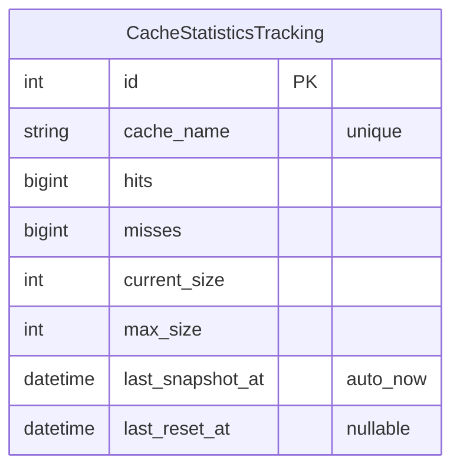

# cache_watcher — Entity-Relationship Diagram

**Companion to:** [`cache_watcher_design.md`](cache_watcher_design.md)
**Author:** Benjamin Schollnick
**Last Updated:** 2026-08-07

---

## What this is

`cache_watcher` owns exactly one model, and it is entirely standalone — no foreign
keys in either direction. Verified against `cache_watcher/models.py`.

---

## Diagram

---

## Reading the diagram

**No relationships to anything else in the schema.**
[`CacheStatisticsTracking`](cache_watcher_design.md#46-modelspy--cachestatisticstracking)
is a periodic snapshot table — one row per named in-memory cache (`fileindex_cache`,
`layout_manager_cache`, and so on, from
[`quickbbs/cache_registry.py`](quickbbs_app_design.md#44-cache_registrypy--central-cache-invalidation))
— written by the `snapshot_cache_statistics` task, not linked to the data those caches
actually hold. It exists so cache hit/miss history survives past what an HTTP-layer
cache-status endpoint could show, and is deliberately decoupled from the caches
themselves: deleting every row here has no effect on the caches it describes, and
clearing a cache has no effect on the historical rows already written.

**The rest of `cache_watcher`'s real work has no database representation at all.**
The filesystem-event buffering, debouncing, and directory-invalidation logic described
in [`cache_watcher_design.md` §4](cache_watcher_design.md#4-component-reference)
operates entirely on
[`DirectoryIndex`](quickbbs_app_design.md#42-directoryindexpy--directoryindex) rows it
doesn't own (see [`high_level_dependency_diagram.md`](high_level_dependency_diagram.md))
and on in-memory state (`LockFreeEventBuffer`, `WatchdogManager`) that never reaches a
table.
