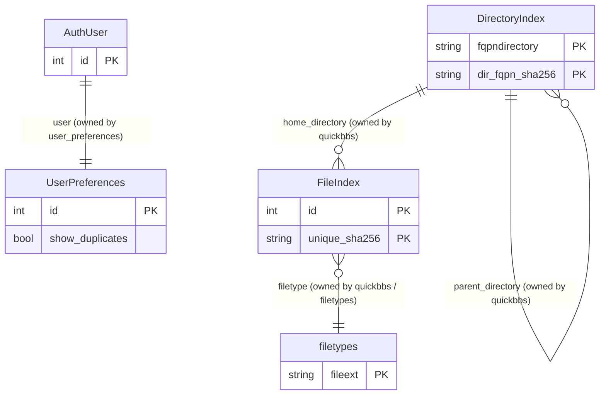

# frontend — Entity-Relationship Diagram

**Companion to:** [`frontend_design.md`](frontend_design.md)
**Author:** Benjamin Schollnick
**Last Updated:** 2026-08-07

---

## What this is

`frontend` owns no models — it has no `models.py` at all. This diagram is
deliberately not a normal ERD; it exists to show which models `frontend` *reads and
writes through its views*, without owning any of them, since that fact isn't visible
from a `models.py` file that doesn't exist. Verified against `frontend/views.py`,
`frontend/managers.py`, `frontend/serve_up.py`, and `frontend/file_listings.py`.

---

## Diagram

---

## Reading the diagram

**Every box here is owned by a different app.** `frontend` is a pure consumer: it
resolves URLs to `DirectoryIndex`/`FileIndex` rows
([`view_gallery`](frontend_design.md#view_galleryrequest),
[`htmx_view_item`](frontend_design.md#htmx_view_itemrequest-sha256)), reads
`filetypes` to decide how to render a file, and reads `UserPreferences.show_duplicates`
to decide which cached SHA list to page through
([`layout_manager`](frontend_design.md#layout_managerpage_number-directory-sort_ordering-show_duplicates),
[`build_context_info`](frontend_design.md#build_context_infounique_file_sha256-sort_order_value-show_duplicates)).
It has no table of its own to add to this diagram — see [`quickbbs_erd.md`](quickbbs_erd.md),
[`filetypes_erd.md`](filetypes_erd.md), and [`user_preferences_erd.md`](user_preferences_erd.md)
for the models themselves.

**The one write path frontend does have** is triggering
[`DirectoryIndex.add_directory()` and `update_database_from_disk()`](quickbbs_app_design.md#42-directoryindexpy--directoryindex)
on a gallery visit (`_find_directory()` in `views.py`) — frontend causes rows to be
created/updated, but the model and the rules for what makes a row valid belong
entirely to `quickbbs`
([§1.1](quickbbs_app_design.md#11-the-filesystem-is-the-source-of-truth-the-database-is-a-cache),
"the filesystem is the source of truth").
