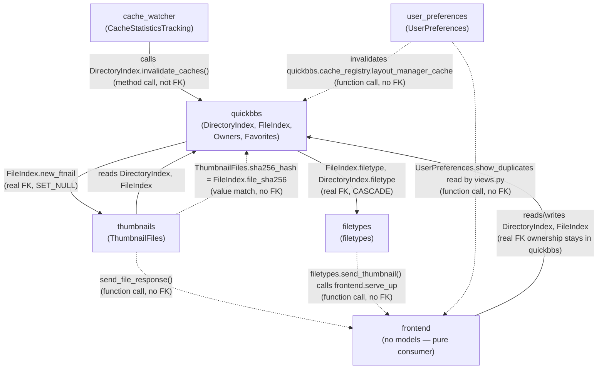

# QuickBBS — High-Level Dependency Diagram

**Companion to:** all per-app design documents and per-app ERDs
**Author:** Benjamin Schollnick
**Last Updated:** 2026-08-07

---

## What this is

A system-level map of how the six sub-applications depend on each other. This is
deliberately **not** an ERD — the connections between apps are a mix of real foreign
keys, hash-based joins with no FK, and plain function calls across app boundaries, and
forcing that mix into entity-relationship notation either lies about which is which or
invents fake "entity attributes" that don't correspond to real columns. A Mermaid
flowchart, labeled by dependency kind, is the right notation here; each app's own
`<app>_erd.md` ([`quickbbs_erd.md`](quickbbs_erd.md), [`frontend_erd.md`](frontend_erd.md),
[`cache_watcher_erd.md`](cache_watcher_erd.md), [`filetypes_erd.md`](filetypes_erd.md),
[`thumbnails_erd.md`](thumbnails_erd.md), [`user_preferences_erd.md`](user_preferences_erd.md))
is still the correct notation for that app's actual schema. Verified by tracing every
cross-app import (`from quickbbs...`, `from frontend...`, etc.) across the codebase —
not by combining the per-app ERDs.

---

## Diagram

**Legend:**

- **Solid arrow** — a real foreign key or a direct method call that mutates the target
  app's model (e.g. `cache_watcher` calling `DirectoryIndex.invalidate_caches()`).
- **Dashed arrow** — either a value-based join with no foreign key (a matching hash
  column) or a plain cross-app function call with no schema relationship at all. Both
  are dashed because neither shows up as a line in any model's `models.py` — the
  distinction between the two is called out in the prose below, not in the arrow style
  itself, since Mermaid flowcharts don't carry enough visual vocabulary for a third
  category without becoming unreadable.

---

## Reading the diagram

**[`quickbbs`](quickbbs_erd.md) is the only app every other app depends on.**
[`frontend`](frontend_erd.md), [`cache_watcher`](cache_watcher_erd.md),
[`thumbnails`](thumbnails_erd.md), and [`user_preferences`](user_preferences_erd.md)
(via its cache-invalidation path) all read or mutate
[`DirectoryIndex`](quickbbs_app_design.md#42-directoryindexpy--directoryindex)/[`FileIndex`](quickbbs_app_design.md#43-fileindexpy--fileindex).
Nothing flows the other way: `quickbbs` imports nothing from any of them at the model
level. Its two outgoing edges — to [`filetypes`](filetypes_erd.md) and to
[`thumbnails`](thumbnails_erd.md) — are both ordinary `CASCADE`/`SET_NULL` foreign
keys it owns, treating both as lookup tables rather than peers.

**Two apps own no data at all.** [`frontend`](frontend_erd.md) has no `models.py` —
every model it touches belongs to a different app (see [`frontend_erd.md`](frontend_erd.md)).
[`cache_watcher`](cache_watcher_erd.md)'s one table
([`CacheStatisticsTracking`](cache_watcher_design.md#46-modelspy--cachestatisticstracking))
is a disconnected diagnostic side-channel; the filesystem-watching logic that is
`cache_watcher`'s actual job reaches `quickbbs` through a method call
(`DirectoryIndex.invalidate_caches()`), never a foreign key — which is why that edge
is solid (it mutates real rows) but the two apps still share no schema relationship
(see [`cache_watcher_erd.md`](cache_watcher_erd.md)).

**[`thumbnails`](thumbnails_erd.md) and [`filetypes`](filetypes_erd.md) are reached by
`quickbbs` via real foreign keys, but reach back by value-match or function call,
never a foreign key of their own.** `ThumbnailFiles.sha256_hash` matches
`FileIndex.file_sha256` by value — no FK points from `thumbnails` back into
`quickbbs`. `filetypes.send_thumbnail()` and thumbnail delivery code both call
[`frontend.serve_up.send_file_response()`](frontend_design.md#44-serve_uppy--file-delivery)
to hand bytes to a browser — a function call across app boundaries, not a row
relationship.

**[`user_preferences`](user_preferences_erd.md) has no foreign key to
[`frontend`](frontend_erd.md) at all.** The connection is
[`frontend/views.py`](frontend_design.md#42-viewspy--request-handlers) reading
`UserPreferences.show_duplicates` at request time, and `user_preferences/views.py`
reaching into
[`quickbbs.cache_registry`](quickbbs_app_design.md#44-cache_registrypy--central-cache-invalidation)
to invalidate `frontend`'s `layout_manager_cache` when that preference changes — two
function calls in opposite directions, with no schema relationship backing either.

**Reading order for a newcomer:** start with [`quickbbs_erd.md`](quickbbs_erd.md) (the
two trees everything else hangs off), then [`filetypes_erd.md`](filetypes_erd.md) and
[`thumbnails_erd.md`](thumbnails_erd.md) (the two lookup/content-addressed
satellites), then [`frontend_erd.md`](frontend_erd.md) and
[`cache_watcher_erd.md`](cache_watcher_erd.md) (the two apps with no tables of their
own), then [`user_preferences_erd.md`](user_preferences_erd.md) (the smallest, most
self-contained piece) — and use this diagram only for the shape of *how* those pieces
call into each other, not for any schema detail.
