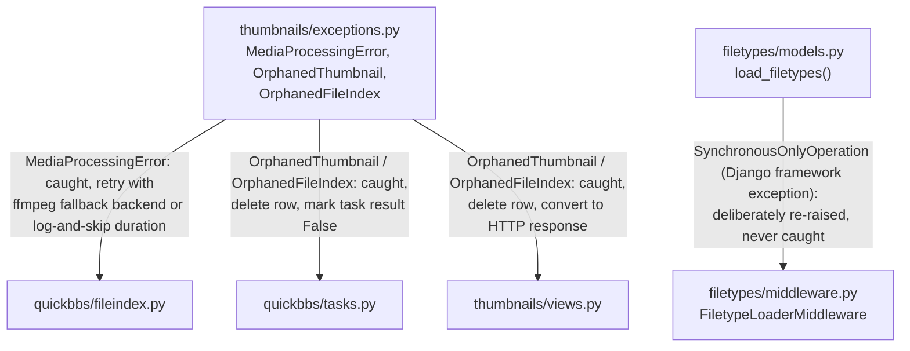

# QuickBBS — High-Level Exception Flow

**Companion to:** all per-app exception-taxonomy files
**Author:** Benjamin Schollnick
**Last Updated:** 2026-08-07

---

## What this is

A system-level map of which custom exceptions cross an app boundary, and what happens
on each side. Most exceptions in this codebase are raised and caught within a single
app — see each app's own `<app>_exceptions.md`
([`quickbbs_exceptions.md`](quickbbs_exceptions.md),
[`frontend_exceptions.md`](frontend_exceptions.md),
[`cache_watcher_exceptions.md`](cache_watcher_exceptions.md),
[`filetypes_exceptions.md`](filetypes_exceptions.md),
[`thumbnails_exceptions.md`](thumbnails_exceptions.md),
[`user_preferences_exceptions.md`](user_preferences_exceptions.md)) for the complete
picture. This file exists only for the exceptions that don't stay within one app's
boundary — like [`high_level_dependency_diagram.md`](high_level_dependency_diagram.md),
this is a Mermaid flowchart (`graph TD`), not an `erDiagram`, since a raised exception
crossing an app boundary isn't a schema relationship, and the same exception pair can
have two completely different terminal handling strategies depending on which side
catches it. Verified by tracing every cross-app exception import
(`from thumbnails.exceptions import ...`, etc.) across the codebase.

---

## Diagram

---

## Reading the diagram

**`thumbnails.MediaProcessingError` crosses into
[`quickbbs/fileindex.py`](quickbbs_exceptions.md#exceptions-consumed-from-thumbnails)
in two places, with two different responses.**
`FileIndex._get_video_info` catches it around a call to the AVFoundation backend and
retries against the ffmpeg fallback backend, re-raising only if the ffmpeg backend was
already the one in use. `FileIndex.check_for_updates` catches it (combined with
`OSError, ValueError, RuntimeError`) around a movie-duration lookup during a
filesystem sync and simply logs and continues, leaving `duration` unset for that one
file rather than aborting the sync. Neither site is a terminal HTTP response — both
are internal to a data-sync or metadata-lookup path.

**`thumbnails.OrphanedThumbnail` / `OrphanedFileIndex` cross into two different apps,
with two different terminal handling strategies for the identical exception pair.**
- In [`quickbbs/tasks.py`](quickbbs_exceptions.md#exceptions-consumed-from-thumbnails)'s
  `generate_missing_thumbnails` background task, both are caught, the orphaned
  `ThumbnailFiles` row is deleted (`exc.thumbnail.delete()`), and that SHA's entry in
  the task's result dict is set to `False` — there's no HTTP response involved; the
  caller is a scheduled task, not a browser request.
- In [`thumbnails/views.py`](thumbnails_exceptions.md#catch-sites-and-terminal-handling)
  itself — the app that defines these exceptions — the same delete-the-row response
  happens, but the terminal step differs by view:
  `thumbnail2_dir` falls back to `directory.filetype.send_thumbnail()` (serves a
  generic icon inline); `thumbnail2_file` returns `HttpResponseBadRequest("File no
  longer exists in gallery.")` (tells the browser outright that the file is gone). The
  same exception pair, defined once, ends up producing three distinct outcomes
  depending on which of these three call sites catches it.

**`filetypes.load_filetypes()`'s `SynchronousOnlyOperation` doesn't really "cross" an
app boundary in the usual sense — it's a Django framework exception `filetypes`
deliberately declines to catch, and the only code that has to account for it lives in
the same app.** [`filetypes/middleware.py`](filetypes_exceptions.md#synchronousonlyoperation-deliberately-re-raised-never-swallowed)'s
`FiletypeLoaderMiddleware.__acall__` avoids ever triggering it by wrapping the call in
`sync_to_async()`; its sync counterpart, `__call__`, calls `load_filetypes()` directly,
which is safe because it's already running in a sync context. This edge is included
here rather than left to `filetypes_exceptions.md` alone because the underlying
exception is a Django framework type, not one `filetypes` defines — it's worth being
able to find from either direction.

**Everything else stays inside one app.** `frontend`'s `DirectoryNotFoundError` and
`DirectoryInvalidError` are raised and caught entirely within `frontend/views.py`.
`cache_watcher` defines no custom exceptions and its broad catches are all local to
its own startup/event-processing code. `user_preferences` has no exception handling
at all. None of these appear in this diagram because none of them cross a boundary —
see each app's own file for its complete internal picture.
