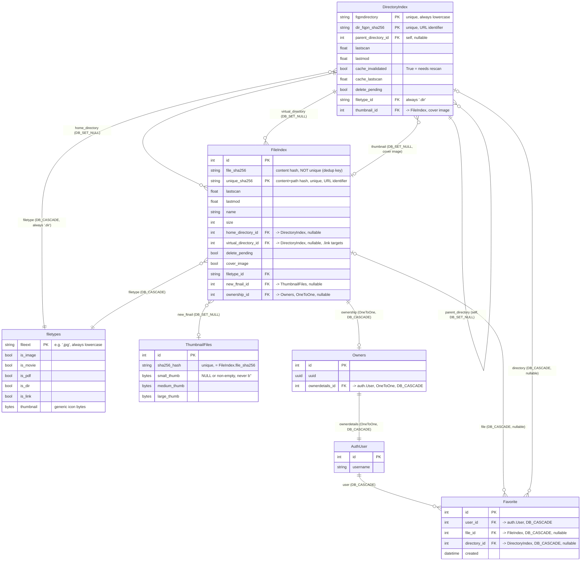

# quickbbs — Entity-Relationship Diagram

**Date Created:** 2026-08-07  
**Last Updated:** 2026-09-20  
**Last Reviewed:** 2026-09-20

**Companion to:** [`quickbbs_app_design.md`](quickbbs_app_design.md)
**Author:** Benjamin Schollnick

---

## What this is

A visual map of every model the `quickbbs` app owns, and how they relate. Field-level
detail (types, indexes, why a field is or isn't indexed) lives in
[`quickbbs_app_design.md` Section 4](quickbbs_app_design.md#4-component-reference) — this
diagram exists to answer "what points at what," not to restate every column. Verified
directly against `quickbbs/quickbbs/{models,directoryindex,fileindex}.py`.

---

## Diagram

---

## Reading the diagram
**On the `DB_` prefix:** every foreign key in this schema uses `models.DB_CASCADE`
or `models.DB_SET_NULL` — DB-enforced `ON DELETE` constraints that require Django
6.1 or newer, not the app-level `models.CASCADE`/`models.SET_NULL`.

**Two self-contained trees meet at one seam.**
[`DirectoryIndex`](quickbbs_app_design.md#42-directoryindexpy--directoryindex) forms
a tree via its own `parent_directory` self-reference;
[`FileIndex`](quickbbs_app_design.md#43-fileindexpy--fileindex) rows hang off that
tree via `home_directory`. The seam between them is `DirectoryIndex.thumbnail`, which
points *forward* into `FileIndex` — a directory's cover image is one of its own files
(or a descendant's, resolved by `get_cover_image()`), not a separate concept.

**Content identity is a hash, not a foreign key.** `FileIndex.file_sha256` is
deliberately *not* unique — every duplicate copy of a file across the collection
shares it ([Section 1.3](quickbbs_app_design.md#13-identical-files-are-the-same-file) of
`quickbbs_app_design.md`). [`ThumbnailFiles`](thumbnails_erd.md)`.sha256_hash` is the
join key that lets every one of those duplicate `FileIndex` rows share a single
thumbnail row through `FileIndex.new_ftnail`, without a join table.
`FileIndex.unique_sha256`, by contrast, is unique per row — it's the content hash plus
the file's path, so it can serve as a stable, regenerable public identifier
([Section 4.3](quickbbs_app_design.md#43-fileindexpy--fileindex)) without needing a UUID.

**`virtual_directory` is for `.link` files, not the file's real location.** A `.link`
file's `home_directory` is where the link file itself sits; `virtual_directory` is set
when the link resolves to a target directory inside the gallery, letting the file act
as if it lives there too without a second `FileIndex` row.

**`Owners` is present but not load-bearing.** It exists only as
`FileIndex.ownership`'s target — "start of a permissions-based model" per its own
docstring, with no other code path populating or reading it today. It is included
here for completeness, not because the rest of the app depends on it.

**`Favorite` is live.** It carries three foreign keys — `user`, and exactly one of
`file`/`directory`, enforced by the `favorite_exactly_one_target` CheckConstraint —
and is read and written from `frontend/views.py` (`Favorite.toggle()`,
`Favorite.for_user()`).

**[`filetypes`](filetypes_erd.md) is the one table every other model points at, never
the reverse.** Both `DirectoryIndex.filetype` and `FileIndex.filetype` are `DB_CASCADE`
foreign keys into it, but `filetypes` itself has no foreign keys out — it's a small,
read-heavy lookup table loaded once into memory
([`filetypes_design.md` Section 1.2](filetypes_design.md#12-the-registry-is-read-constantly-and-changes-almost-never)),
not a participant in the directory/file tree.
