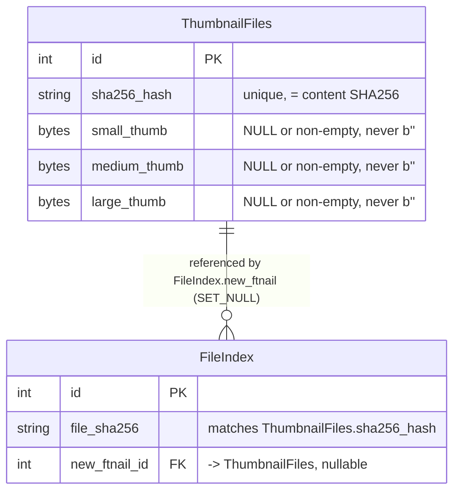

# thumbnails — Entity-Relationship Diagram

**Companion to:** [`thumbnails_design.md`](thumbnails_design.md)
**Author:** Benjamin Schollnick
**Last Updated:** 2026-08-07

---

## What this is

`thumbnails` owns exactly one model, content-addressed rather than linked by a normal
foreign key from its own side. Verified against `thumbnails/models.py` and
[`quickbbs/fileindex.py`](quickbbs_app_design.md#43-fileindexpy--fileindex)'s
`new_ftnail` field.

---

## Diagram

---

## Reading the diagram

**The join key is a content hash, not a row-to-row foreign key from the source side.**
[`ThumbnailFiles`](thumbnails_design.md#410-modelspy--thumbnailfiles)`.sha256_hash` is
the SHA256 of the file's *content*, matching `FileIndex.file_sha256` — not
`FileIndex.id` or `FileIndex.unique_sha256`. That's what lets every duplicate copy of
a file across the whole collection
([§1.3](quickbbs_app_design.md#13-identical-files-are-the-same-file) of
`quickbbs_app_design.md`) share exactly one `ThumbnailFiles` row: they all carry the
same `file_sha256`, so `get_or_create_thumbnail_record()` finds and reuses the same
row for every one of them, regardless of how many directories the file appears in.

**One row holds all three sizes.** `small_thumb`, `medium_thumb`, and `large_thumb`
live on the same row rather than three separate rows or a size column — a single
`sha256_hash` lookup can serve any of the three sizes a caller asks for.

**[`FileIndex`](quickbbs_erd.md)`.new_ftnail` is the only pointer between the two
models, and it's nullable.** A `FileIndex` row with no thumbnail generated yet (or a
non-thumbnailable filetype) simply has `new_ftnail = None`; `SET_NULL` means deleting
a `ThumbnailFiles` row un-links every `FileIndex` row pointing at it rather than
cascading the delete.
