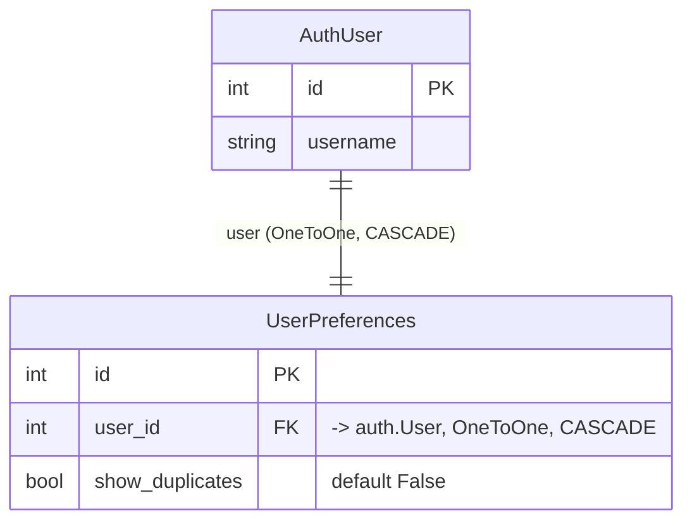

# user_preferences — Entity-Relationship Diagram

**Companion to:** N/A (no standalone `user_preferences_design.md` exists yet)
**Author:** Benjamin Schollnick
**Last Updated:** 2026-08-07

---

## What this is

`user_preferences` owns exactly one model: a one-row-per-user settings table.
Verified against `user_preferences/models.py`.

---

## Diagram

---

## Reading the diagram

**One preferences row per user, never zero or many.** The `OneToOneField` on `user`
enforces this at the database level — there is no code path that creates a second
`UserPreferences` row for an existing user, and `CASCADE` means deleting a user deletes
their preferences row rather than leaving an orphan.

**`show_duplicates` is the only preference that exists today.** It controls whether a
user sees every copy of a cross-filed file or the deduplicated view
([§1.3](quickbbs_app_design.md#13-identical-files-are-the-same-file) of
`quickbbs_app_design.md`); reading it is cached in
[`frontend/views.py`](frontend_design.md#42-viewspy--request-handlers)'s
`_user_pref_cache` (a `ThreadSafeTTLCache`), and toggling it explicitly clears that
cache entry.
