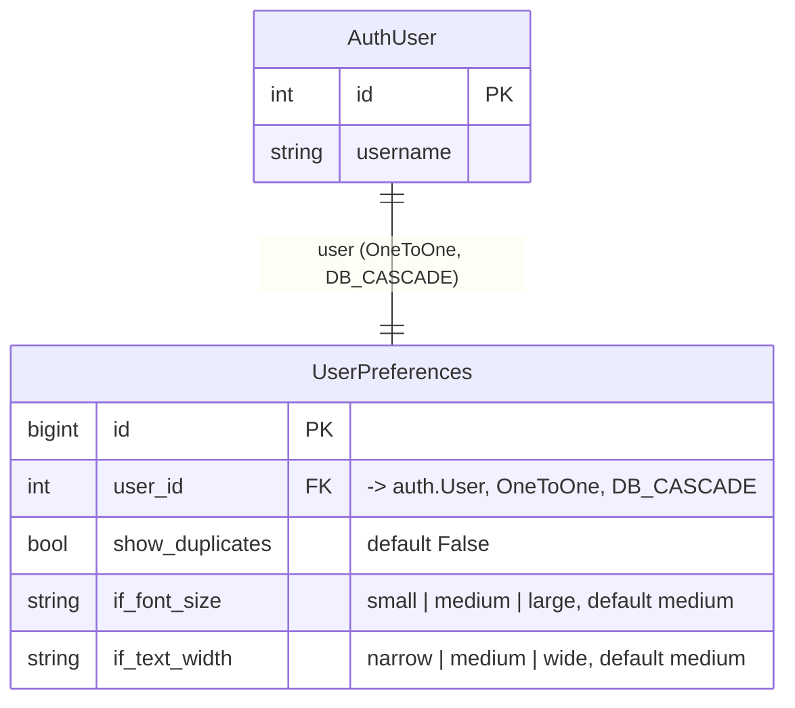

# user_preferences — Entity-Relationship Diagram

**Date Created:** 2026-08-07  
**Last Updated:** 2026-09-20  
**Last Reviewed:** 2026-09-20

**Companion to:** N/A (no standalone `user_preferences_design.md` exists yet)
**Author:** Benjamin Schollnick

---

## What this is

`user_preferences` owns exactly one model: a one-row-per-user settings table.
Verified against `user_preferences/models.py`.

---

## Diagram

---

## Reading the diagram
**On the `DB_` prefix:** every foreign key in this schema uses `models.DB_CASCADE`
or `models.DB_SET_NULL` — DB-enforced `ON DELETE` constraints that require Django
6.1 or newer, not the app-level `models.CASCADE`/`models.SET_NULL`.

**One preferences row per user, never zero or many.** The `OneToOneField` on `user`
enforces this at the database level — there is no code path that creates a second
`UserPreferences` row for an existing user, and `DB_CASCADE` means deleting a user deletes
their preferences row rather than leaving an orphan.

**Three preferences exist today.** `show_duplicates` controls whether a
user sees every copy of a cross-filed file or the deduplicated view
([Section 1.3](quickbbs_app_design.md#13-identical-files-are-the-same-file) of
`quickbbs_app_design.md`); reading it is cached in
[`frontend/views.py`](frontend_design.md#42-viewspy--request-handlers)'s
`_user_pref_cache` (a `ThreadSafeTTLCache`), and toggling it explicitly clears that
cache entry.

`if_font_size` and `if_text_width` set the Interactive Fiction reader's display —
each a `CharField(max_length=10)` with a fixed choice list, defaulting to
`"medium"`. They are read by the `interactive_fiction` app's views and templates,
not by the gallery.
